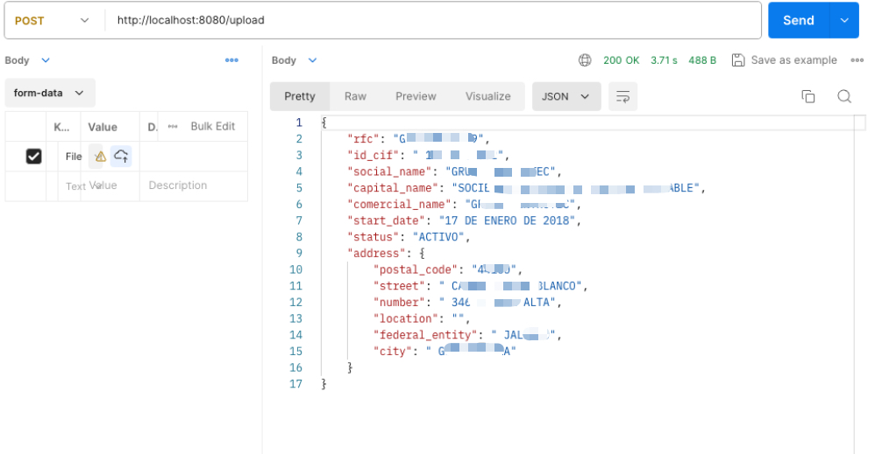
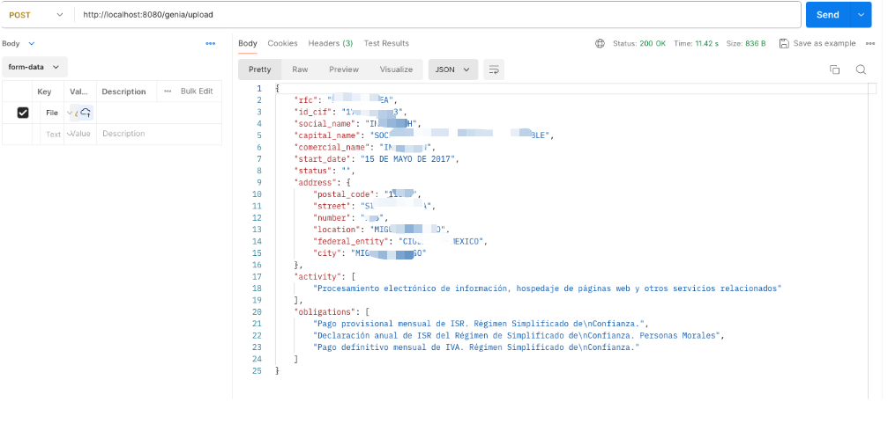

## POC para integração com GCP Document AI

### Objetivo:
Validar a integração com Document AI para leitura e extração de dados de documentos (jpg e pdf).

### Pré-requisitos:
- GO 1.21 ou superior

Adicionar variáveis de ambiente para autenticação com GCP:
- GOOGLE_APPLICATION_CREDENTIALS: caminho para o arquivo de credenciais do GCP
- GOOGLE_CLOUD_PROJECT: nome do projeto no GCP
- 
**Versão OCR**:
- GOOGLE_CLOUD_LOCATION: região do projeto no GCP
- GOOGLE_CLOUD_PROCESSOR_ID: ID do processador de Document AI no GCP

**Versão Generative IA**:
- GOOGLE_CLOUD_LOCATION_GENIA: região do projeto no GCP
- GOOGLE_CLOUD_PROCESSOR_ID__GENIA: ID do processador de Document AI no GCP

### Uso:
- Executar o comando `go run main.go` para iniciar o servidor local.

Processamento de arquivo via OCR:

**Request**
```
curl --location 'http://localhost:8080/upload' \
--form 'file=@"file_path"'
```
**Response**


Processamento de arquivo via Generative IA:

**Request**
```
curl --location 'http://localhost:8080/genia/upload' \
--form 'file=@"file_path"'
```
**Response**

